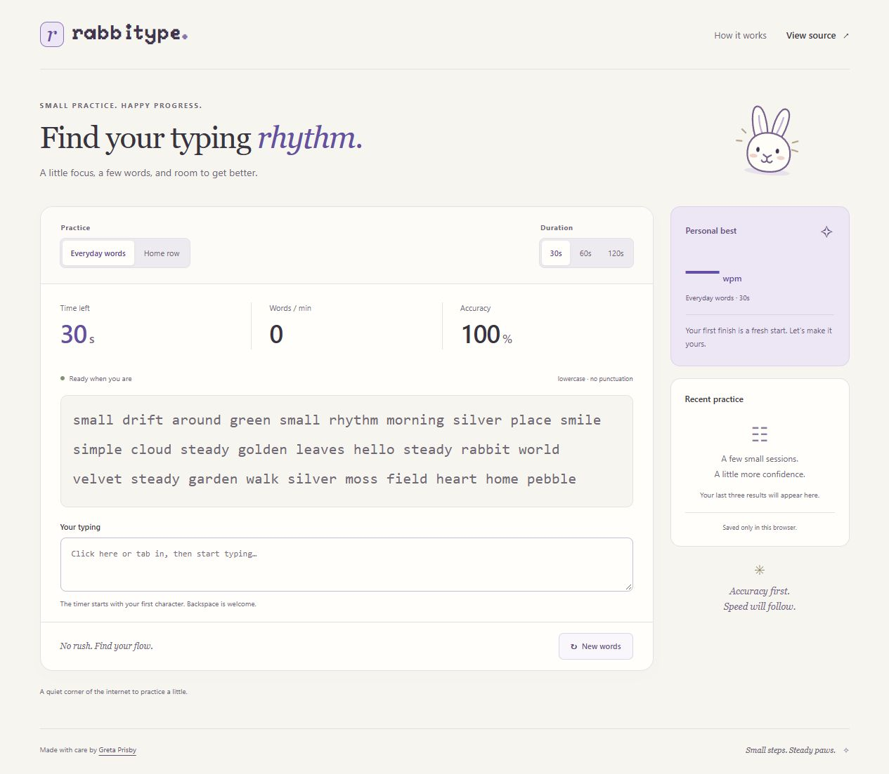

# Rabbitype

A calm, playful typing practice app. Choose a pace, type a few words, and track your progress without an account.

[Try the live demo](https://greta.github.io/rabbitype/) · [Greta's GitHub](https://github.com/Greta)



## The experience

- Everyday words and home row practice, with 30, 60, or 120 second sessions.
- A timer that starts with the first character and pauses when the tab or window loses focus.
- Live speed and accuracy, visible mistake feedback, and a prompt that follows your typing.
- Backspace, pause, resume, and restart controls, followed by a focused results screen.
- Personal bests for each mode and duration, plus recent practice saved in this browser.
- Responsive layout, native keyboard controls, visible focus, and a labelled typing field.

## Why this project

Rabbitype began as an experimental typing game with a pixel-art title screen and plans for a story mode. This refresh keeps the playful name and original pixel font while concentrating on one complete practice experience.

The work demonstrates frontend skills through a small, usable product: explicit state transitions, tested scoring rules, accessible interactions, responsive CSS, resilient browser storage, and a production build that deploys to GitHub Pages. The unfinished story menus and Electron launcher remain available in Git history.

## Design and engineering decisions

**Native text input.** Typing uses a labelled textarea instead of intercepting printable keys on the document. Tab navigation, text selection, correction, and mobile keyboards keep their native behavior. Pasting and dropping text are blocked during practice. Mistakes use an underline as well as color.

**A predictable session model.** A pure reducer owns four phases: ready, running, paused, and finished. `performance.now()` measures active elapsed time; display updates do not determine the deadline. Late timer callbacks cannot extend a session, and paused time is excluded.

**Explicit scoring.** WPM is the number of currently correct characters divided by five and by active minutes. Accuracy is correct character insertions divided by all character insertions. Deleting a mistake does not erase it from accuracy; retyping does not inflate speed. Results are rounded to whole numbers. These are practice metrics, not a standardized typing certification.

**Local progress.** A versioned, validated localStorage record keeps the last 10 sessions and separate bests for each mode and duration. The sidebar shows the latest three. A tied speed is ranked by accuracy. If storage is unavailable, the app keeps working with progress held for that visit.

**A small toolchain.** React, TypeScript, and Vite power the app. Plain CSS handles layout and styling. There is no backend, external font request, analytics service, or UI component dependency. The original Peaberry font is used only for the wordmark.

## Run locally

Use Node.js 24 (see `.nvmrc`); Node.js 22.12 or later is supported by the build tools.

```sh
npm ci
npm run dev
```

Open the local URL printed in the terminal, including its `/rabbitype/` path.

```sh
npm run check    # tests, TypeScript checks, and production build
npm run preview  # serve the production build locally
```

`npm run format` formats the source with Prettier. `npm run check` also checks formatting.

### Publish to GitHub Pages

The live demo is served from the repository's `gh-pages` branch. With Git authenticated and a commit identity configured, run `npm run deploy`. This checks the source, builds the app, and publishes `dist` while preserving the deployment branch's history. The Vite base path is `/rabbitype/`.

## Validation

Vitest and React Testing Library cover timer start, pause/resume, deadline handling, correction and replacement scoring, stored bests, malformed/unavailable storage, keyboard settings, paste blocking, and the complete results flow under React Strict Mode. axe-core checks the structure of the practice and results screens. Color contrast is checked separately because the test DOM does not calculate visual layout.

Manual browser checks cover prompt scrolling, keyboard pause, the native help dialog and focus restoration, saved results after reload, and desktop and narrow phone layouts. This is not a claim of a full WCAG audit or exhaustive assistive-technology testing.

The Check workflow runs tests and a production build on pull requests and pushes to `master`.

## Project map

| File              | Responsibility                                        |
| ----------------- | ----------------------------------------------------- |
| `src/App.tsx`     | Controls, session lifecycle, results, and progress UI |
| `src/session.ts`  | Pure timing transitions and scoring                   |
| `src/history.ts`  | Validated local progress and personal bests           |
| `src/passages.ts` | Mode-specific word generation                         |
| `src/Passage.tsx` | Character feedback and prompt scrolling               |
| `src/base.css`    | Responsive presentation and focus styles              |

## Scope and next steps

This version intentionally uses a small English word bank, lowercase text, and local progress. Potential next steps include a punctuation mode, a larger curated word bank, and testing with screen-reader users. The current app does not include a story mode, cloud sync, or a leaderboard.
